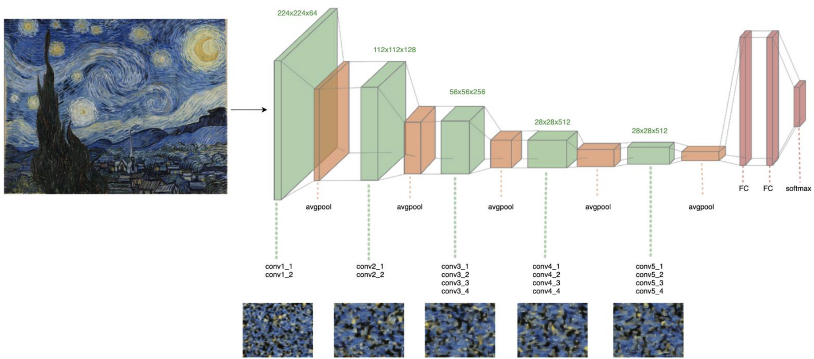

# nst_zoo (work in progress)
Inspired by [Gatys et al. 2015](https://arxiv.org/abs/1508.06576)

## Does the world really need another repo for neural style transfer?
Probably not, but I think this one is unique in that it supports all combinations of:
- torchvision Models
- Optimization Methods
- Weighting Schemes
- Loss functions & normalization methods
- Pooling replacement ("avg" vs "max")

## Usage
#### Default Configuration:
`python -m nst_zoo.nst_main` will use the following default configuration (as proposed by Gatys et al. 2015):
- Vangogh's Starry Night as the Style Target
- VGG19 model, with max-pooling replaced by average pooling
- LBFGS Optimization with a Strong Wolfe constraint on curvature (not mentioned in the original paper, but suggested online)

#### Other Configuration Options:
- Currently only supports Style targets (will raise `NotImplementedError` if Content targets are passed)
- See [NSTConfig](https://github.com/Nick-Morgan/nst-zoo/blob/main/nst_zoo/config.py) for all configuration options

#### Batch Processing
- You may find use in the `nst-processor` command if you plan to evaluate many configurations.
- See the [batch_processing README](https://github.com/Nick-Morgan/nst-zoo/blob/main/nst_zoo/batch_processing/README.md) for more info 

#### CUDA:
- `docker-compose.yml` and `Dockerfile` are provided for convenience
-  The default device for CUDA is `1`, but you may override this via the environment variable `CUDA`

## Contributing:
- This repo is not yet ready for contributions. I will update the README when this changes.

